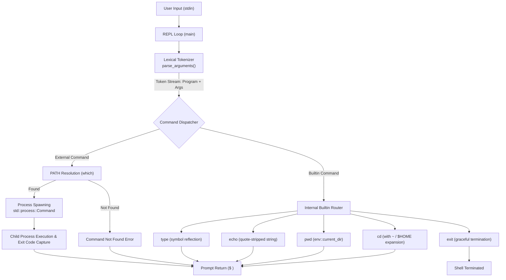

# Rush — POSIX-Compliant Shell in Rust

[](https://www.rust-lang.org/)
[]()
[]()

A lightweight, POSIX-aligned command-line interpreter (shell) built from scratch in Rust. Features a custom state-machine tokenizer supporting nested quoting, dynamic executable path resolution, process lifecycle management, and native built-in utility commands.

Designed and implemented to explore low-level systems programming concepts: lexical analysis, process spawning (`fork`/`exec` semantics), file system interaction, and standard I/O multiplexing in a memory-safe environment without garbage collection overhead.

---

## Architecture Overview

The shell follows a classic **REPL (Read-Eval-Print Loop)** architecture structured into modular stages:



---

## Key Technical Features

### 1. State-Machine Lexical Tokenizer
- **Quote-Aware Parsing**: Hand-rolled deterministic finite-state scanner (`parse_arguments`) that differentiates between single quotes (`'...'`), double quotes (`"..."`), and unquoted whitespace delimiters.
- **Literal Preservation**: Properly preserves literal characters, internal whitespace, and empty strings within quotes while stripping surrounding delimiter quotes.
- **Memory Efficiency**: Utilizes `std::mem::take` to extract token buffers without redundant heap reallocations.

### 2. Builtin Command Dispatcher
Executes internal commands directly within the shell process to preserve shell state and avoid unnecessary process fork overhead:
- **`cd`**: Changes working directory via `std::env::set_current_dir`, featuring dynamic tilde (`~`) expansion resolving to `$HOME`.
- **`pwd`**: Displays the canonical current working directory.
- **`echo`**: Formats and prints tokenized arguments separated by single spaces.
- **`type`**: Inspects command names and reflects whether a given symbol is an internal shell builtin or maps to an executable on the filesystem `PATH`.
- **`exit`**: Gracefully tears down the REPL session with zero exit status.

### 3. External Process Management & PATH Resolution
- **Subprocess Spawning**: Dispatches external binaries using Rust's `std::process::Command`, executing child processes with inherited stdin/stdout/stderr streams.
- **PATH Lookup**: Integrates path lookup to dynamically discover binaries across system `$PATH` entries.
- **Robust Error Handling**: Differentiates between non-existent binaries (`ErrorKind::NotFound`) and execution/permission failures, emitting clean POSIX diagnostics.

---

## Resume Highlights & Interview Talking Points

If discussing this project on a resume or during mid-level software engineering interviews, leverage these key bullets and talking points:

### Resume Bullet Points (STAR Format)
- **Engineered a POSIX-compliant shell in Rust**, implementing an end-to-end REPL architecture with custom lexical analysis, command dispatch, and external process management.
- **Built a deterministic state-machine argument parser** supporting nested single/double quote handling and whitespace tokenization, optimizing buffer allocations with `std::mem::take`.
- **Architected built-in utility routing** (`cd`, `pwd`, `echo`, `type`, `exit`) to manipulate shell process state and integrated binary resolution across `$PATH` with robust error propagation.
- **Leveraged Rust's strict type system and ownership semantics** to eliminate buffer overflows, dangling pointers, and unhandled I/O failures common in traditional C-based shell implementations.

### Technical Interview Discussion Areas
- **Why Builtins Need In-Process Execution**: Why commands like `cd` cannot be run as child processes (a child process modifying its current working directory does not affect the parent process environment).
- **Zero-Allocation Tokenizer Techniques**: Trade-offs between streaming string scanners vs. regex-based tokenizers, and how state-tracking prevents catastrophic backtracking and memory bloat.
- **System Calls & Process Model**: How `std::process::Command` maps to Unix `fork(2)` and `execve(2)` under the hood, and how process status codes and signals are monitored.

---

## Getting Started

### Prerequisites
- **Rust Toolchain**: Rust 1.80+ (2024 edition) and Cargo.
  ```sh
  curl --proto '=https' --tlsv1.2 -sSf https://sh.rustup.rs | sh
  ```

### Build and Run
```sh
# Clone the repository
git clone https://github.com/<your-username>/rush.git
cd rush

# Build in release mode
cargo build --release

# Run the shell
cargo run --release
```

---

## Example Usage

```sh
$ echo "Hello    world"
Hello world

$ type cd
cd is a shell builtin

$ type ls
ls is /bin/ls

$ pwd
/Users/developer/rush

$ cd ~
$ pwd
/Users/developer

$ ls -la
total 64
drwxr-xr-x  12 developer staff  384 Oct  8 16:00 .
drwxr-xr-x   6 root      admin  192 Sep 20 10:14 ..
...

$ non_existent_cmd
non_existent_cmd: command not found

$ exit
```

---

## Engineering Roadmap / Future Extensions

- [ ] **I/O Redirection**: Implement file descriptor manipulation for standard streams (`>`, `>>`, `2>`, `<`).
- [ ] **Pipeline Execution (`|`)**: Support chaining arbitrary child processes using Unix anonymous pipes (`pipe(2)`).
- [ ] **Signal Handling**: Integrate `signal-hook` / `tokio` for clean `SIGINT` (Ctrl+C) and `SIGTSTP` (Ctrl+Z) interception without killing the parent shell.
- [ ] **Environment Variable Expansion**: Support `$VAR` substitution directly in the tokenizer.
- [ ] **Autocompletion & Line Editing**: Integrate `rustyline` for history navigation, reverse search, and tab completion.
